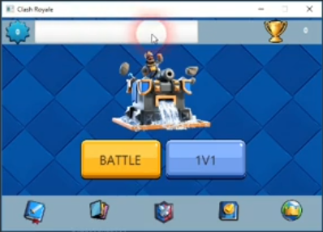

## JClash 
JClash is a clone of the popular and beloved game, "Clash Royale". The entire game is written in Java and we've used JavaFX for GUI. No game engines were used in the process. The game tries to mimic the logic of the original game. You can play with a bot at three levels of difficulty, or play with a friend over network. This project was completed during the Spring semester of 2021, which was my second semester at Amirkabir University, for the Advanced Programming course. 

### Game Play 

<video width="600" controls>
  <source src="assets/gameplay.mp4" type="video/mp4">
  Your browser does not support the video tag.
</video>

### Walk through 

#### Login Page

  

#### Home 

  

#### Choosing Troops 

  

 
#### Multiplayer 

  

